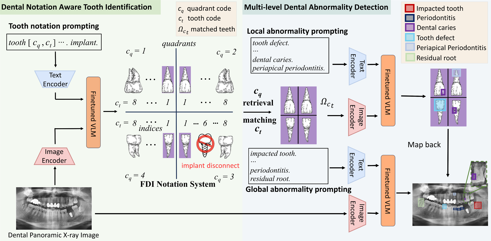

# Prompting Vision-Language Models for Dental Notation Aware Abnormality Detection
This repository will contain annotations and code that underpins the innovative research presented in the MICCAI 2024 paper Prompting Vision-Language Models for Dental Notation Aware Abnormality Detection. 
Authors: Chenlin Du, Xiaoxuan Chen, Jingyi Wang, Junjie Wang, Zhongsen Li, Zongjiu Zhang, Qicheng Lao.

